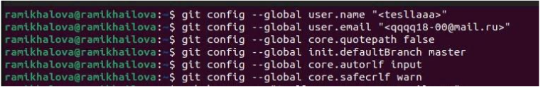
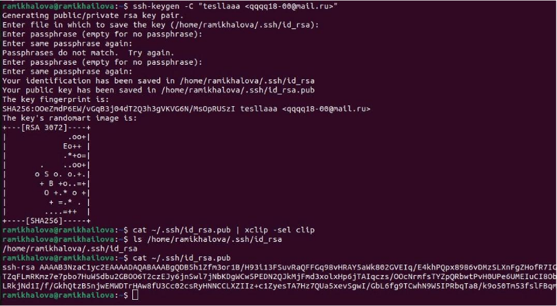
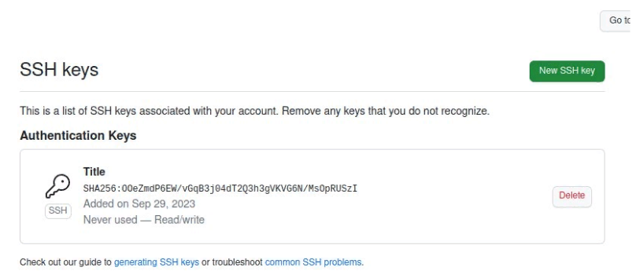
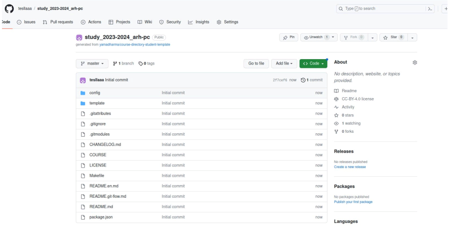
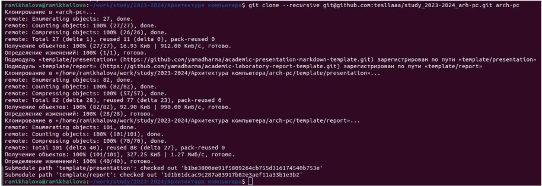
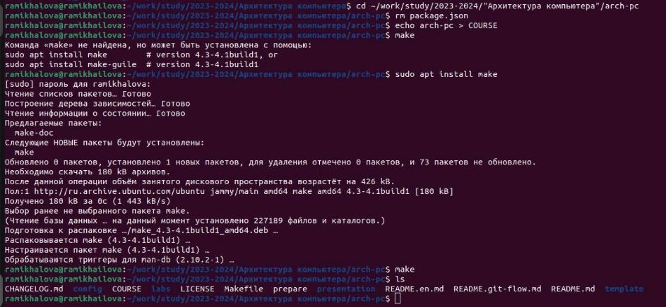
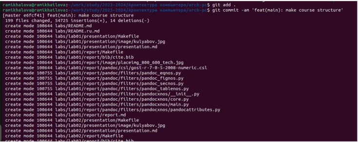
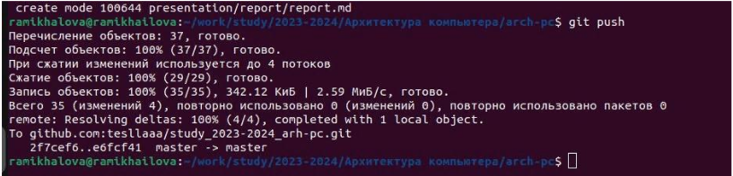
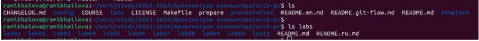
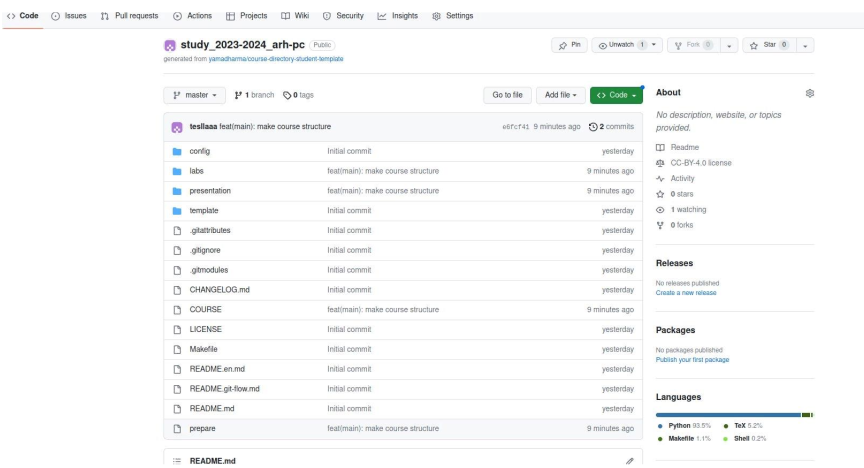

---
## Front matter
title: "Отчет по лабораторной работе №2"
subtitle: "дисциплина: Архитектура компьютера"
author: "Михайлова Регина Алексеевна"

## Generic otions
lang: ru-RU
toc-title: "Содержание"

## Bibliography
bibliography: bib/cite.bib
csl: pandoc/csl/gost-r-7-0-5-2008-numeric.csl

## Pdf output format
toc: true # Table of contents
toc-depth: 2
lof: true # List of figures
lot: true # List of tables
fontsize: 12pt
linestretch: 1.5
papersize: a4
documentclass: scrreprt
## I18n polyglossia
polyglossia-lang:
  name: russian
  options:
	- spelling=modern
	- babelshorthands=true
polyglossia-otherlangs:
  name: english
## I18n babel
babel-lang: russian
babel-otherlangs: english
## Fonts
mainfont: PT Serif
romanfont: PT Serif
sansfont: PT Sans
monofont: PT Mono
mainfontoptions: Ligatures=TeX
romanfontoptions: Ligatures=TeX
sansfontoptions: Ligatures=TeX,Scale=MatchLowercase
monofontoptions: Scale=MatchLowercase,Scale=0.9
## Biblatex
biblatex: true
biblio-style: "gost-numeric"
biblatexoptions:
  - parentracker=true
  - backend=biber
  - hyperref=auto
  - language=auto
  - autolang=other*
  - citestyle=gost-numeric
## Pandoc-crossref LaTeX customization
figureTitle: "Рис."
tableTitle: "Таблица"
listingTitle: "Листинг"
lofTitle: "Список иллюстраций"
lotTitle: "Список таблиц"
lolTitle: "Листинги"
## Misc options
indent: true
header-includes:
  - \usepackage{indentfirst}
  - \usepackage{float} # keep figures where there are in the text
  - \floatplacement{figure}{H} # keep figures where there are in the text
---

# Цель работы

Изучение идеологиии и применение средств контроля версий. Приобрестение
практических и теоретических навыков по работе с системой git.

# Выполнение лабораторной работы
1. Сначала сделаем предварительную конфигурацию git. (рис. @fig:001). Откроем терминал и введем следующие команды, указав имя и email владельца репозитория:
git config --global user.name "<Name Surname>" git
config --global user.email "<work@mail>"
Настроим utf-8 в выводе сообщений git: git config --global core.quotepath false
Зададим имя начальной ветки (будем называть её master): git config --global init.defaultBranch master
Параметр autocrlf: git config --global core.autocrlf input
Параметр safecrlf: git config --global core.safecrlf warn

{#fig:001 width=90%}

2. Для последующей идентификации пользователя на сервере репозиториев необходимо сгенерировать пару ключей (приватный и открытый) (рис. @fig:002): 
ssh-keygen -C "Имя Фамилия <work@mail>"

Ключи сохранятся в каталоге ~/.ssh/. Далее необходимо загрузить сгенерённый открытый ключ (рис. @fig:003). 
Для этого зайти на сайт http://github.org/ под своей учётной записью и перейти в меню . 

После этого выбрать в боковом меню SSH and GPG keys и нажать кнопку . Скопировав из локальной консоли ключ в буфер обмена

cat ~/.ssh/id_rsa.pub | xclip -sel clip вставляем ключ в появившееся на сайте поле и указываем для ключа имя (Title).

{#fig:002 width=90%}

{#fig:003 width=90%}

3. Откроем терминал и создадим каталог для предмета «Архитектура компьютера» (рис. @fig:004):
mkdir -p ~/work/study/2023-2024/"Архитектура компьютера"

{#fig:004 width=90%}

4. Перейдем на станицу репозитория с шаблоном курса https://github.com/yamadharma/course-directory-student-template.
Далее выберем Use this template.
В открывшемся окне задаем имя репозитория(Repository name)study_2023–2024_arh-pc и создаем репозиторий (кнопка Create repository from template) (рис. @fig:005).

{#fig:005 width=90%}

5. Откроем терминал и перейдем в каталог курса:
cd ~/work/study/2023–2024/"Архитектура компьютера" 
клонируем созданный репозиторий: git clone (рис. @fig:006) --recursive git@github.com:<user_name>/study_2023–2024_arh-pc.git ↪ arch-pc

{#fig:006 width=90%}

6. Переходим в каталог курса:
cd ~/work/study/2023-2024/"Архитектура компьютера"/arch-pc 
Удаляем лишние файлы: rm package.json 
Создаем необходимые каталоги (рис. @fig:006) : echo arch-pc > COURSE make

{#fig:007 width=90%}

Отправляем файлы на сервер (рис. @fig:008, @fig:009): 
git add .
git commit -am 'feat(main): make course structure'
git push

{#fig:008 width=90%}

{#fig:009 width=90%}

Проверяем правильность создания иерархии рабочего пространства в локальном репозитории (рис. @fig:010) 
и на странице github (рис. @fig:011).

{#fig:010 width=90%}

{#fig:011 width=90%}

# Выполнение заданий для самостоятельной работы

# Выводы

Я изучила идеологию и применение средств контроля версий. Научилась работать с
системой git на практике.

# Список литературы
1. GDB: The GNU Project Debugger. — URL: https://www.gnu.org/software/gdb/.
2. GNU Bash Manual. — 2016. — URL: https://www.gnu.org/software/bash/manual/.
3. Midnight Commander Development Center. — 2021. — URL: https://midnight-commander.
org/.
4. NASM Assembly Language Tutorials. — 2021. — URL: https://asmtutor.com/.
5. Newham C. Learning the bash Shell: Unix Shell Programming. — O’Reilly Media, 2005. —
354 с. — (In a Nutshell). — ISBN 0596009658. — URL: http://www.amazon.com/Learning-
bash-Shell-Programming-Nutshell/dp/0596009658.
6. Robbins A. Bash Pocket Reference. — O’Reilly Media, 2016. — 156 с. — ISBN 978-1491941591.
7. The NASM documentation. — 2021. — URL: https://www.nasm.us/docs.php.
8. Zarrelli G. Mastering Bash. — Packt Publishing, 2017. — 502 с. — ISBN 9781784396879.
9. Колдаев В. Д., Лупин С. А. Архитектура ЭВМ. — М. : Форум, 2018.
10. Куляс О. Л., Никитин К. А. Курс программирования на ASSEMBLER. — М. : Солон-Пресс,
2017.
11. Новожилов О. П. Архитектура ЭВМ и систем. — М. : Юрайт, 2016.
12. Расширенный ассемблер: NASM. — 2021. — URL: https://www.opennet.ru/docs/RUS/nasm/.
13. Робачевский А., Немнюгин С., Стесик О. Операционная система UNIX. — 2-е изд. — БХВ-
Петербург, 2010. — 656 с. — ISBN 978-5-94157-538-1.
14. Столяров А. Программирование на языке ассемблера NASM для ОС Unix. — 2-е изд. —
М. : МАКС Пресс, 2011. — URL: http://www.stolyarov.info/books/asm_unix.
15. Таненбаум Э. Архитектура компьютера. — 6-е изд. — СПб. : Питер, 2013. — 874 с. —
(Классика Computer Science).
16. Таненбаум Э., Бос Х. Современные операционные системы. — 4-е изд. — СПб. : Питер,
2015. — 1120 с. — (Классика Computer Science)

