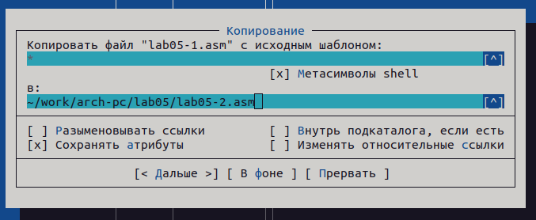

---
## Front matter
title: "Отчет по лабораторной работе №5"
subtitle: "дисциплина: Архитектура компьютера"
author: "Михайлова Регина Алексеевна"

## Generic otions
lang: ru-RU
toc-title: "Содержание"

## Bibliography
bibliography: bib/cite.bib
csl: pandoc/csl/gost-r-7-0-5-2008-numeric.csl

## Pdf output format
toc: true # Table of contents
toc-depth: 2
lof: true # List of figures
lot: true # List of tables
fontsize: 12pt
linestretch: 1.5
papersize: a4
documentclass: scrreprt
## I18n polyglossia
polyglossia-lang:
  name: russian
  options:
	- spelling=modern
	- babelshorthands=true
polyglossia-otherlangs:
  name: english
## I18n babel
babel-lang: russian
babel-otherlangs: english
## Fonts
mainfont: PT Serif
romanfont: PT Serif
sansfont: PT Sans
monofont: PT Mono
mainfontoptions: Ligatures=TeX
romanfontoptions: Ligatures=TeX
sansfontoptions: Ligatures=TeX,Scale=MatchLowercase
monofontoptions: Scale=MatchLowercase,Scale=0.9
## Biblatex
biblatex: true
biblio-style: "gost-numeric"
biblatexoptions:
  - parentracker=true
  - backend=biber
  - hyperref=auto
  - language=auto
  - autolang=other*
  - citestyle=gost-numeric
## Pandoc-crossref LaTeX customization
figureTitle: "Рис."
tableTitle: "Таблица"
listingTitle: "Листинг"
lofTitle: "Список иллюстраций"
lolTitle: "Листинги"
## Misc options
indent: true
header-includes:
  - \usepackage{indentfirst}
  - \usepackage{float} # keep figures where there are in the text
  - \floatplacement{figure}{H} # keep figures where there are in the text
---

# Цель работы

Приобретение практических навыков работы в Midnight Commander. Освоение инструкций
языка ассемблера mov и int.


# Выполнение лабораторной работы

1. Открываем Midnight Commander:

user@dk4n31:~$ mc

2. Пользуясь клавишами ↑ , ↓ и Enter переходим в каталог ~/work/arch-pc созданный
при выполнении лабораторной работы №4 (рис. @fig:001).

3. С помощью функциональной клавиши F7 создайте папку lab05 и переходим
в созданный каталог.

4. Пользуясь строкой ввода и командой touch создаем файл lab5-1.asm (рис. @fig:002).

{#fig:001 width=90%}

{#fig:002 width=90%}

{#fig:003 width=90%}

{#fig:004 width=90%}

5. С помощью функциональной клавиши F4 открываем файл lab5-1.asm для редактирова-
ния во встроенном редакторе. Как правило в качестве встроенного редактора Midnight
Commander используется редакторы nano (рис. @fig:003) или mcedit (рис. @fig:004).

6. Вводим текст программы из листинга 5.1, сохраняем изме-
нения и закрываем файл.

```NASM
Листинг 5.1. Программа вывода сообщения на экран и ввода строки с клавиатуры

;------------------------------------------------------------------
; Программа вывода сообщения на экран и ввода строки с клавиатуры
;------------------------------------------------------------------
;------------------- Объявление переменных ----------------
SECTION .data ; Секция инициированных данных
msg: DB 'Введите строку:',10 ; сообщение плюс
; символ перевода строки
msgLen: EQU $-msg ; Длина переменной 'msg'
SECTION .bss ; Секция не инициированных данных
buf1: RESB 80 ; Буфер размером 80 байт
------------------- Текст программы -----------------
SECTION .text ; Код программы
GLOBAL _start ; Начало программы
_start: ; Точка входа в программу
;------------ Cистемный вызов `write`
; После вызова инструкции 'int 80h' на экран будет
; выведено сообщение из переменной 'msg' длиной 'msgLen'
mov eax,4 ; Системный вызов для записи (sys_write)
mov ebx,1 ; Описатель файла 1 - стандартный вывод
mov ecx,msg ; Адрес строки 'msg' в 'ecx'
mov edx,msgLen ; Размер строки 'msg' в 'edx'
int 80h ; Вызов ядра
;------------ системный вызов `read` ----------------------
; После вызова инструкции 'int 80h' программа будет ожидать ввода
; строки, которая будет записана в переменную 'buf1' размером 80 байт
mov eax, 3 ; Системный вызов для чтения (sys_read)
mov ebx, 0 ; Дескриптор файла 0 - стандартный ввод
mov ecx, buf1 ; Адрес буфера под вводимую строку
mov edx, 80 ; Длина вводимой строки
int 80h ; Вызов ядра
;------------ Системный вызов `exit` ----------------------
; После вызова инструкции 'int 80h' программа завершит работу
mov eax,1 ; Системный вызов для выхода (sys_exit)
mov ebx,0 ; Выход с кодом возврата 0 (без ошибок)
int 80h ; Вызов ядра
```


7. С помощью функциональной клавиши F3 открываем файл lab5-1.asm для просмотра.
Убеждаемся, что файл содержит текст программы.

8. Оттранслируем текст программы lab5-1.asm в объектный файл. Выполняем компо-
новку объектного файла и запускаем получившийся исполняемый файл. Программа выводит строку 'Введите строку:' и ожидает ввода с клавиатуры. На запрос вводим наше ФИО. (рис. @fig:005)

user@dk4n31:~$ nasm -f elf lab5-1.asm
user@dk4n31:~$ ld -m elf_i386 -o lab5-1 lab5-1.o
user@dk4n31:~$ ./lab5-1
Введите строку:
Имя пользователя
user@dk4n31:~$

{#fig:005 width=90%}

9. Скачиваем файл in_out.asm со страницы курса в ТУИС.

10. Подключаемый файл in_out.asm должен лежать в том же каталоге, что и файл с про-
граммой, в которой он используется.
В одной из панелей mc открываем каталог с файлом lab5-1.asm. В другой панели каталог
со скаченным файлом in_out.asm.
Копируем файл in_out.asm в каталог с файлом lab5-1.asm с помощью функциональной
клавиши F5.

11. С помощью функциональной клавиши F6 создаем копию файла lab5-1.asm с именем
lab5-2.asm. Выделяем файл lab5-1.asm, нажимаем клавишу F6 , вводим имя файла
lab5-2.asm и нажимаем клавишу Enter (рис. @fig:006).

{#fig:006 width=90%}

12. Исправляем текст программы в файле lab5-2.asm с использованием подпрограмм из
внешнего файла in_out.asm (используйте подпрограммы sprintLF, sread и quit) в
соответствии с листингом 5.2. Создаем исполняемый файл и проверяем его работу. (рис. @fig:007)

```NASM
Листинг 5.2. Программа вывода сообщения на экран и ввода строки с клавиатуры c
использованием файла in_out.asm


;--------------------------------------------------------------------
; Программа вывода сообщения на экран и ввода строки с клавиатуры
;---------------------------------------------------------------------
%include 'in_out.asm' ; подключение внешнего файла
SECTION .data ; Секция инициированных данных
msg: DB 'Введите строку: ',0h ; сообщение
SECTION .bss ; Секция не инициированных данных
buf1: RESB 80 ; Буфер размером 80 байт
SECTION .text ; Код программы
GLOBAL _start ; Начало программы
_start: ; Точка входа в программу
mov eax, msg ; запись адреса выводимого сообщения в `EAX`
call sprintLF ; вызов подпрограммы печати сообщения
mov ecx, buf1 ; запись адреса переменной в `EAX`
mov edx, 80 ; запись длины вводимого сообщения в `EBX`
call sread ; вызов подпрограммы ввода сообщения
call quit ; вызов подпрограммы завершения
```

13. В файле lab5-2.asm заменяем подпрограмму sprintLF на sprint. Создаем исполняе-
мый файл и проверяем его работу. (рис. @fig:007)

{#fig:007 width=90%}

Сверяем две программы. Их разница в том, что sprintLF делает перенос строки, а значит без этой команды текст будет выводиться сразу, без переноса.

# Выполнение заданий для самостоятельной работы

1. Создаем копию файла lab5-1.asm. Вносим изменения в программу (без использова-
ния внешнего файла in_out.asm), так чтобы она работала по следующему алгоритму (рис. @fig:008):

• вывести приглашение типа “Введите строку:”;
• ввести строку с клавиатуры;
• вывести введённую строку на экран.

{#fig:008 width=90%}

2. Получаем исполняемый файл и проверяем его работу (рис. @fig:009). На приглашение ввести строку
вводим свою фамилию.

{#fig:009 width=90%}

3. Создаем копию файла lab5-2.asm. Исправляем текст программы с использование под-
программ из внешнего файла in_out.asm, так чтобы она работала по следующему
алгоритму (рис. @fig:010):

• вывести приглашение типа “Введите строку:”;
• ввести строку с клавиатуры;
• вывести введённую строку на экран.

{#fig:010 width=90%}

4. Создаем исполняемый файл и проверяем его работу (рис. @fig:011).

{#fig:011 width=90%}


# Вывод

В ходе лабораторной работы я приобрела практические навыки работы в Midnight Commander и освоила инструкции
языка ассемблера mov и int.

# Список литературы

1. GDB: The GNU Project Debugger. — URL: https://www.gnu.org/software/gdb/.
2. GNU Bash Manual. — 2016. — URL: https://www.gnu.org/software/bash/manual/.
3. Midnight Commander Development Center. — 2021. — URL: https://midnight-commander.
org/.
4. NASM Assembly Language Tutorials. — 2021. — URL: https://asmtutor.com/.
5. Newham C. Learning the bash Shell: Unix Shell Programming. — O’Reilly Media, 2005. —
354 с. — (In a Nutshell). — ISBN 0596009658. — URL: http://www.amazon.com/Learning-
bash-Shell-Programming-Nutshell/dp/0596009658.
6. Robbins A. Bash Pocket Reference. — O’Reilly Media, 2016. — 156 с. — ISBN 978-1491941591.
7. The NASM documentation. — 2021. — URL: https://www.nasm.us/docs.php.
8. Zarrelli G. Mastering Bash. — Packt Publishing, 2017. — 502 с. — ISBN 9781784396879.
9. Колдаев В. Д., Лупин С. А. Архитектура ЭВМ. — М. : Форум, 2018.
10. Куляс О. Л., Никитин К. А. Курс программирования на ASSEMBLER. — М. : Солон-Пресс,
2017.
11. Новожилов О. П. Архитектура ЭВМ и систем. — М. : Юрайт, 2016.
12. Расширенный ассемблер: NASM. — 2021. — URL: https://www.opennet.ru/docs/RUS/nasm/.
13. Робачевский А., Немнюгин С., Стесик О. Операционная система UNIX. — 2-е изд. — БХВ-
Петербург, 2010. — 656 с. — ISBN 978-5-94157-538-1.
14. Столяров А. Программирование на языке ассемблера NASM для ОС Unix. — 2-е изд. —
М. : МАКС Пресс, 2011. — URL: http://www.stolyarov.info/books/asm_unix.
15. Таненбаум Э. Архитектура компьютера. — 6-е изд. — СПб. : Питер, 2013. — 874 с. —
(Классика Computer Science).
16. Таненбаум Э., Бос Х. Современные операционные системы. — 4-е изд. — СПб. : Питер,
2015. — 1120 с. — (Классика Computer Science).

