---
## Front matter
title: "Отчет по лабораторной работе №6"
subtitle: "дисциплина: Архитектура компьютера"
author: "Михайлова Регина Алексеевна"

## Generic otions
lang: ru-RU
toc-title: "Содержание"

## Bibliography
bibliography: bib/cite.bib
csl: pandoc/csl/gost-r-7-0-5-2008-numeric.csl

## Pdf output format
toc: true # Table of contents
toc-depth: 2
lof: true # List of figures
lot: true # List of tables
fontsize: 12pt
linestretch: 1.5
papersize: a4
documentclass: scrreprt
## I18n polyglossia
polyglossia-lang:
  name: russian
  options:
	- spelling=modern
	- babelshorthands=true
polyglossia-otherlangs:
  name: english
## I18n babel
babel-lang: russian
babel-otherlangs: english
## Fonts
mainfont: PT Serif
romanfont: PT Serif
sansfont: PT Sans
monofont: PT Mono
mainfontoptions: Ligatures=TeX
romanfontoptions: Ligatures=TeX
sansfontoptions: Ligatures=TeX,Scale=MatchLowercase
monofontoptions: Scale=MatchLowercase,Scale=0.9
## Biblatex
biblatex: true
biblio-style: "gost-numeric"
biblatexoptions:
  - parentracker=true
  - backend=biber
  - hyperref=auto
  - language=auto
  - autolang=other*
  - citestyle=gost-numeric
## Pandoc-crossref LaTeX customization
figureTitle: "Рис."
tableTitle: "Таблица"
listingTitle: "Листинг"
lofTitle: "Список иллюстраций"
lolTitle: "Листинги"
## Misc options
indent: true
header-includes:
  - \usepackage{indentfirst}
  - \usepackage{float} # keep figures where there are in the text
  - \floatplacement{figure}{H} # keep figures where there are in the text
---

# Цель работы

Освоение арифметических инструкций языка ассемблера NASM.


# Выполнение лабораторной работы

1. Создадим каталог для программам лабораторной работы № 6, перейдем в него и
создадим файл lab6-1.asm (рис. @fig:001).

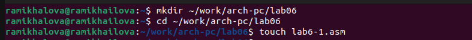{#fig:001 width=90%}

2. Рассмотрим примеры программ вывода символьных и численных значений. Програм-
мы будут выводить значения записанные в регистр eax.

Введём в файл lab6-1.asm текст программы из листинга 6.1. В данной программе в ре-
гистр eax записываем символ 6 (mov eax,'6'), в регистр ebx символ 4 (mov ebx,'4').
Далее к значению в регистре eax прибавляем значение регистра ebx (add eax,ebx, ре-
зультат сложения запишется в регистр eax). Далее выводим результат. Так как для работы
функции sprintLF в регистр eax должен быть записан адрес, необходимо использовать до-
полнительную переменную. Для этого запишем значение регистра eax в переменную buf1
(mov [buf1],eax), а затем запишем адрес переменной buf1 в регистр eax (mov eax,buf1) и
вызовем функцию sprintLF.

```NASM
Листинг 6.1. Программа вывода значения регистра eax

%include 'in_out.asm'
SECTION .bss
buf1: RESB 80
SECTION .text
GLOBAL _start
_start:
mov eax,'6'
mov ebx,'4'
add eax,ebx
mov [buf1],eax
mov eax,buf1
call sprintLF
call quit
```

Создаем исполняемый файл и запускаем его (рис. @fig:002).

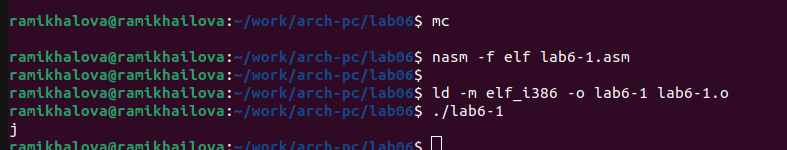{#fig:002 width=90%}

В данном случае при выводе значения регистра eax мы ожидаем увидеть число 10. Однако
результатом будет символ j. Это происходит потому, что код символа 6 равен 00110110 в
двоичном представлении, а код символа 4 – 00110100. Команда add eax,ebx запишет в регистр eax сумму кодов – 01101010 (106), что в свою
очередь является кодом символа j.

3. Далее изменим текст программы и вместо символов, запишем в регистры числа. Ис-
правим текст программы следующим образом (рис. @fig:003):

заменяем строки:
mov eax,'6'
mov ebx,'4'

на строки:
mov eax,6
mov ebx,4

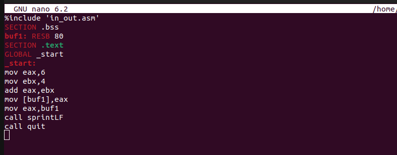{#fig:003 width=90%}

Создаем исполняемый файл и запускаем его.

Как и в предыдущем случае при исполнении программы мы не получим число 10. В данном
случае выводится символ с кодом 10. Пользуясь таблицей ASCII определяем какому символу
соответствует код 10 (рис. @fig:004).

{#fig:004 width=90%}

Коду 10 соответствует символ переноса строки, поэтому мы видим на экране пустую строку.

4. Для работы с числами в файле in_out.asm реализованы подпрограммы для преобразования ASCII символов в числа и обратно. Преобразуем текст
программы из Листинга 6.1 с использованием этих функций.

Создаем файл lab6-2.asm в каталоге ~/work/arch-pc/lab06 и вводим в него текст про-
граммы из листинга 6.2.

Листинг 6.2. Программа вывода значения регистра eax

%include 'in_out.asm'
SECTION .text
GLOBAL _start
_start:
mov eax,'6'
mov ebx,'4'
add eax,ebx
call iprintLF
call quit


Создаем исполняемый файл и запускаем его (рис. @fig:005).

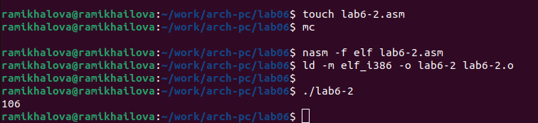{#fig:005 width=90%}

В результате работы программы мы получим число 106. В данном случае, как и в первом,
команда add складывает коды символов ‘6’ и ‘4’ (54+52=106). Однако, в отличии от программы
из листинга 6.1, функция iprintLF позволяет вывести число, а не символ, кодом которого
является это число.

5. Аналогично предыдущему примеру изменим символы на числа. 

Заменим строки:
mov eax,'6'
mov ebx,'4'

на строки:
mov eax,6
mov ebx,4

Создаем исполняемый файл и запускаем его (рис. @fig:006).

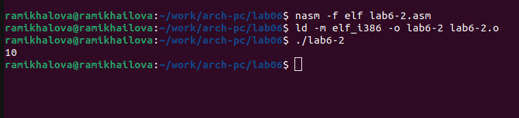{#fig:006 width=90%}

А теперь заменим функцию iprintLF на iprint. Снова создаем исполняемый файл и запускаем его (рис. @fig:007).

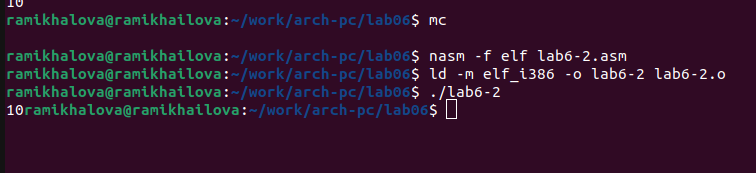{#fig:007 width=90%}

Можем заметить, что функция iprint в отличие от iprintLF не выводит на экран перенос строки после числа 10.

6. Ознакомимся с арифметическими операциями NASM. В качестве примера приведем прорамму вычисления арифметического выражения $/𝑓(𝑥) = (5 ∗ 2 + 3):3$.

Создаем файл lab6-3.asm в каталоге ~/work/arch-pc/lab06.

Внимательно изучаем текст программы из листинга 6.3 и вводим в lab6-3.asm.

Листинг 6.3. Программа вычисления выражения $/𝑓(𝑥) = (5 ∗ 2 + 3):3$

```NASM
;--------------------------------
; Программа вычисления выражения
;--------------------------------
%include 'in_out.asm' ; подключение внешнего файла
SECTION .data
div: DB 'Результат: ',0
rem: DB 'Остаток от деления: ',0
ECTION .text
GLOBAL _start
_start:
; ---- Вычисление выражения
mov eax,5 ; EAX=5
mov ebx,2 ; EBX=2
mul ebx ; EAX=EAX*EBX
add eax,3 ; EAX=EAX+3
xor edx,edx ; обнуляем EDX для корректной работы div
mov ebx,3 ; EBX=3
div ebx ; EAX=EAX/3, EDX=остаток от деления
mov edi,eax ; запись результата вычисления в 'edi'
; ---- Вывод результата на экран
mov eax,div ; вызов подпрограммы печати
call sprint ; сообщения 'Результат: '
mov eax,edi ; вызов подпрограммы печати значения
call iprintLF ; из 'edi' в виде символов
mov eax,rem ; вызов подпрограммы печати
call sprint ; сообщения 'Остаток от деления: '
mov eax,edx ; вызов подпрограммы печати значения
call iprintLF ; из 'edx' (остаток) в виде символов
call quit ; вызов подпрограммы завершения
```

Создаем исполняемый файл и запускаем его (рис. @fig:008).

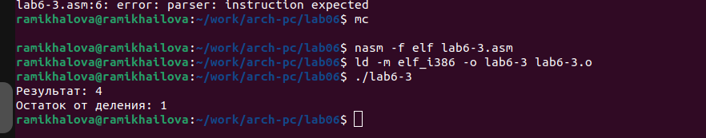{#fig:008 width=90%}

Изменим текст программы для вычисления выражения $/𝑓(𝑥) = (4 ∗ 6 + 2)/5$(рис. @fig:009). Создадим
исполняемый файл и проверяем его работу (рис. @fig:0010).

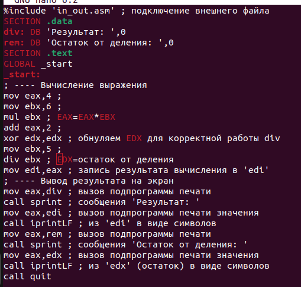{#fig:009 width=90%}

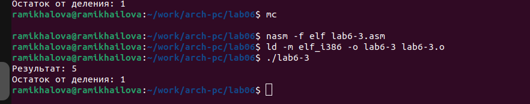{#fig:010 width=90%}

7. В качестве другого примера рассмотрим программу вычисления варианта задания по
номеру студенческого билета, работающую по следующему алгоритму:
• вывести запрос на введение № студенческого билета
• вычислить номер варианта по формуле: (𝑆𝑛 mod 20) + 1, где 𝑆𝑛 – номер студен-
ческого билета (В данном случае 𝑎 mod 𝑏 – это остаток от деления 𝑎 на 𝑏).
• вывести на экран номер варианта.

Создаем файл variant.asm в каталоге ~/work/arch-pc/lab06.

Внимательно изучаем текст программы из листинга 6.4 и вводим в файл variant.asm.

Листинг 6.4. Программа вычисления вычисления варианта задания по номеру
студенческого билета

```NASM
;--------------------------------
; Программа вычисления варианта
;--------------------------------
%include 'in_out.asm'
SECTION .data
msg: DB 'Введите № студенческого билета: ',0
rem: DB 'Ваш вариант: ',0
SECTION .bss
x: RESB 80
SECTION .text
GLOBAL _start
_start:
mov eax, msg
call sprintLF
mov ecx, x
mov edx, 80
call sread
mov eax,x ; вызов подпрограммы преобразования
call atoi ; ASCII кода в число, `eax=x`
xor edx,edx
mov ebx,20
div ebx
inc edx
mov eax,rem
call sprint
mov eax,edx
call iprintLF
call quit
```

Создаем исполняемый файл и запускаем его (рис. @fig:011). 

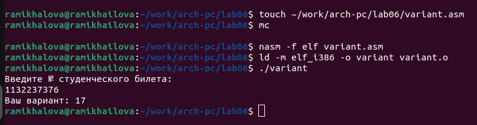{#fig:011 width=90%}

Ответим на вопросы по лабораторной работе:

1. В листинге 6.4 за вывод на экран сообщения ‘Ваш вариант:’ отвечают строки:
• rem: DB 'Ваш вариант:',0 ;в строке мы объявляем переменную rem,
куда записали искомую строку
• mov eax,rem ;помещаем строку в регистр eax
• call sprint ;вызываем подпрограмму вывода из файла in_out.asm
2. Инструкции mov ecx,x -> mov edx,80 -> call sread используются для
того, чтобы ввести с клавиатуры строку отведённого размера (80) и поме-
стить её по адресу x. Для этого x помещаем в регистр ecx, а длину строки
(80) - в регистр edx. call sread - вызов функции печати.
3. Инструкция call atoi используется для преобразования символов в числа.
4. За вычисление варианта отвечают строки:
• mov eax,x ;поместили x в регистр eax
• call atoi ;преобразование символов в число
• xor edx,edx ;обнуляем edx
• mov ebx,20 :поместили в регистр ebx число 20
• div ebx ;поделили число, лежащее в eax, на число, лежащее в ebx
• inc edx ;edx + 1
5. Остаток от деления при выполнении div ebx записывается в регистр edx.
6. Инструкция inc edx используется для увеличение значения регистра edx на
1.
7. За вывод на экран результата вычислений отвечают строки:
• mov eax,edx ;помещаем результат вычислений в регистр eax
• call iprintLF ;выводим на экран содержимое регистра eax

# Выполнение заданий для самостоятельной работы

Необходимо написать программу, вычисляющую значение заданной функции
f(x) в зависимости от введённого значения x. Варианту 17 соответствует формула
следующей функции:
$/18(𝑥 + 1)/6$

Создаем программу (рис. @fig:012).

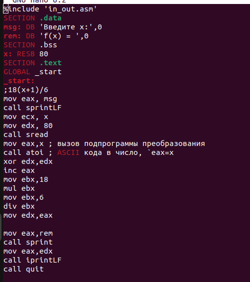{#fig:012 width=90%}

И проверяем его работу (рис. @fig:013).

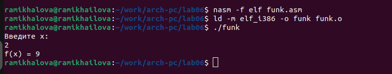{#fig:013 width=90%}

# Вывод

Мы освоили арифметические инструкции языка ассемблера NASM, научились
составлять арифметические программы.

# Список литературы

1. GDB: The GNU Project Debugger. — URL: https://www.gnu.org/software/gdb/.
2. GNU Bash Manual. — 2016. — URL: https://www.gnu.org/software/bash/manual/.
3. Midnight Commander Development Center. — 2021. — URL: https://midnight-
commander. org/.
4. NASM Assembly Language Tutorials. — 2021. — URL: https://asmtutor.com/.
5. Newham C. Learning the bash Shell: Unix Shell Programming. — O’Reilly
Media, 2005. — 354 с. — (In a Nutshell). — ISBN 0596009658. — URL:
http://www.amazon.com/Learning- bash-Shell-Programming-Nutshell/dp/0596009658.
6. Robbins A. Bash Pocket Reference. — O’Reilly Media, 2016. — 156 с. — ISBN
978-1491941591.
7. The NASM documentation. — 2021. — URL: https://www.nasm.us/docs.php.
8. Zarrelli G. Mastering Bash. — Packt Publishing, 2017. — 502 с. — ISBN
9781784396879.
9. Колдаев В. Д., Лупин С. А. Архитектура ЭВМ. — М. : Форум, 2018.
10. Куляс О. Л., Никитин К. А. Курс программирования на ASSEMBLER. — М. :
Солон-Пресс


