---
## Front matter
title: "Отчет по лабораторной работе №9"
subtitle: "дисциплина: Архитектура компьютера"
author: "Михайлова Регина Алексеевна"

## Generic otions
lang: ru-RU
toc-title: "Содержание"

## Bibliography
bibliography: bib/cite.bib
csl: pandoc/csl/gost-r-7-0-5-2008-numeric.csl

## Pdf output format
toc: true # Table of contents
toc-depth: 2
lof: true # List of figures
lot: true # List of tables
fontsize: 12pt
linestretch: 1.5
papersize: a4
documentclass: scrreprt
## I18n polyglossia
polyglossia-lang:
  name: russian
  options:
	- spelling=modern
	- babelshorthands=true
polyglossia-otherlangs:
  name: english
## I18n babel
babel-lang: russian
babel-otherlangs: english
## Fonts
mainfont: PT Serif
romanfont: PT Serif
sansfont: PT Sans
monofont: PT Mono
mainfontoptions: Ligatures=TeX
romanfontoptions: Ligatures=TeX
sansfontoptions: Ligatures=TeX,Scale=MatchLowercase
monofontoptions: Scale=MatchLowercase,Scale=0.9
## Biblatex
biblatex: true
biblio-style: "gost-numeric"
biblatexoptions:
  - parentracker=true
  - backend=biber
  - hyperref=auto
  - language=auto
  - autolang=other*
  - citestyle=gost-numeric
## Pandoc-crossref LaTeX customization
figureTitle: "Рис."
tableTitle: "Таблица"
listingTitle: "Листинг"
lofTitle: "Список иллюстраций"
lotTitle: "Список таблиц"
lolTitle: "Листинги"
## Misc options
indent: true
header-includes:
  - \usepackage{indentfirst}
  - \usepackage{float} # keep figures where there are in the text
  - \floatplacement{figure}{H} # keep figures where there are in the text
---

# Цель работы

Приобретение навыков написания программ с использованием подпрограмм. Знакомство
с методами отладки при помощи GDB и его основными возможностями

# Выполнение лабораторной работы

1. Создайте каталог для выполнения лабораторной работы № 9, перейдите в него и со-
здайте файл lab09-1.asm (рис. @fig:001):
mkdir ~/work/arch-pc/lab09
cd ~/work/arch-pc/lab09
touch lab09-1.asm

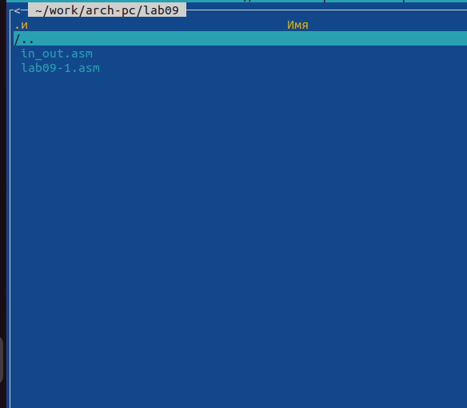{#fig:001 width=90%}

2. В качестве примера рассмотрим программу вычисления арифметического выражения
𝑓(𝑥) = 2𝑥 + 7 с помощью подпрограммы _calcul. В данном примере 𝑥 вводится с
клавиатуры, а само выражение вычисляется в подпрограмме. Внимательно изучите
текст программы (Листинг 9.1).

```NASM
Листинг 9.1. Пример программы с использованием вызова подпрограммы
%include 'in_out.asm'
ECTION .data
msg: DB 'Введите x: ',0
result: DB '2x+7=',0
SECTION .bss
x: RESB 80
res: RESB 80
SECTION .text
GLOBAL _start
_start:
;------------------------------------------
; Основная программа
;------------------------------------------
mov eax, msg
call sprint
mov ecx, x
mov edx, 80
call sread
mov eax,x
call atoi
call _calcul ; Вызов подпрограммы _calcul
mov eax,result
call sprint
mov eax,[res]
call iprintLF
call quit
;------------------------------------------
; Подпрограмма вычисления
; выражения "2x+7"
_calcul:
mov ebx,2
mul ebx
add eax,7
mov [res],eax
ret ; выход из подпрограммы
mov [res],eax
ret ; выход из подпрограммы
```

Первые строки программы отвечают за вывод сообщения на экран (call sprint), чтение
данных введенных с клавиатуры (call sread) и преобразования введенных данных из
символьного вида в численный (call atoi).

```NASM
mov eax, msg ; вызов подпрограммы печати сообщения
call sprint ; 'Введите x: '
mov ecx, x
mov edx, 80
call sread ; вызов подпрограммы ввода сообщения
mov eax,x ; вызов подпрограммы преобразования
call atoi ; ASCII кода в число, `eax=x`
После следующей инструкции call _calcul, которая передает управление подпрограмме
_calcul, будут выполнены инструкции подпрограммы:
mov ebx,2
mul ebx
add eax,7
mov [res],eax
ret
```

Инструкция ret является последней в подпрограмме и ее исполнение приводит к воз-
вращению в основную программу к инструкции, следующей за инструкцией call, которая
вызвала данную подпрограмму.
Последние строки программы реализую вывод сообщения (call sprint), результата вы-
числения (call iprintLF) и завершение программы (call quit).
Введите в файл lab09-1.asm текст программы из листинга 9.1. Создайте исполняемый
файл и проверьте его работу (рис. @fig:002).

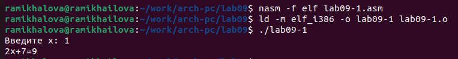{#fig:002 width=90%}

Измените текст программы, добавив подпрограмму _subcalcul в подпрограмму _calcul,
для вычисления выражения 𝑓(𝑔(𝑥)), где 𝑥 вводится с клавиатуры, 𝑓(𝑥) = 2𝑥 + 7, 𝑔(𝑥) =
3𝑥 − 1. Т.е. 𝑥 передается в подпрограмму _calcul из нее в подпрограмму _subcalcul, где
вычисляется выражение 𝑔(𝑥), результат возвращается в _calcul и вычисляется выражение
𝑓(𝑔(𝑥)). Результат возвращается в основную программу для вывода результата на экран.

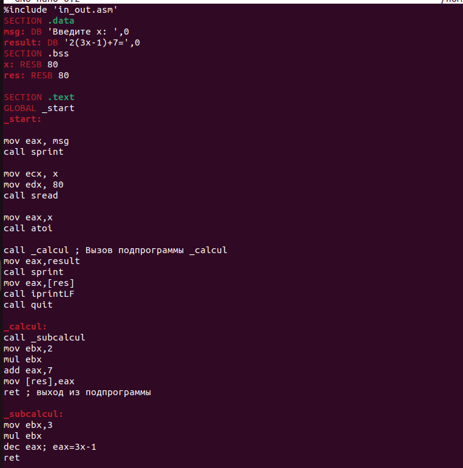{#fig:003 width=90%}

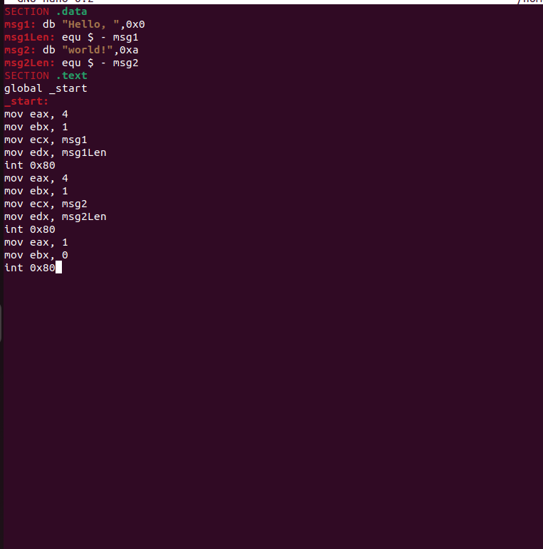{#fig:004 width=90%}

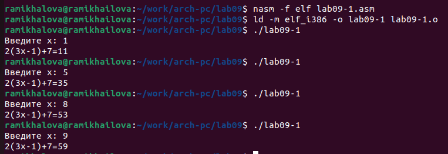{#fig:005 width=90%}

Создайте файл lab09-2.asm с текстом программы из Листинга 9.2. (Программа печати
сообщения Hello world!):

```NASM
Листинг 9.2. Программа вывода сообщения Hello world!
SECTION .data
msg1: db "Hello, ",0x0
msg1Len: equ $ - msg1
msg2: db "world!",0xa
msg2Len: equ $ - msg2
SECTION .text
global _start
_start:
mov eax, 4
mov ebx, 1
mov ecx, msg1
mov edx, msg1Len
int 0x80
mov eax, 4
mov ebx, 1
mov ecx, msg2
mov edx, msg2Len
int 0x80
mov eax, 1
mov ebx, 0
int 0x80
```

Получите исполняемый файл. Для работы с GDB в исполняемый файл необходимо добавить
отладочную информацию, для этого трансляцию программ необходимо проводить с ключом
‘-g’ (рис. @fig:006).

nasm -f elf -g -l lab09-2.lst lab09-2.asm
ld -m elf_i386 -o lab09-2 lab09-2.o

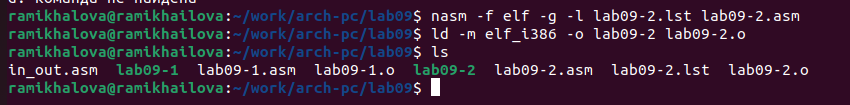{#fig:006 width=90%}

Загрузите исполняемый файл в отладчик gdb (рис. @fig:007):
user@dk4n31:~$ gdb lab09-2
Проверьте работу программы, запустив ее в оболочке GDB с помощью команды run (со-
кращённо r) (рис. @fig:008).

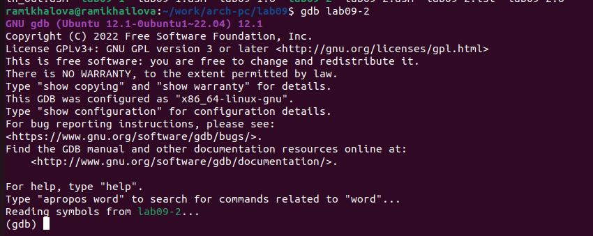{#fig:007 width=90%}

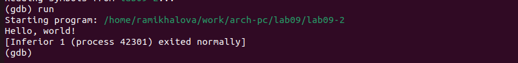{#fig:008 width=90%}

Для более подробного анализа программы установите брейкпоинт на метку _start (рис. @fig:009), с
которой начинается выполнение любой ассемблерной программы, и запустите её.

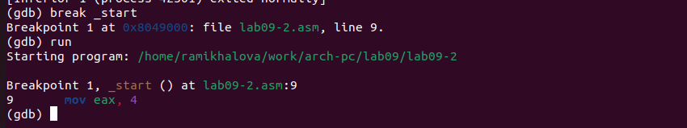{#fig:009 width=90%}

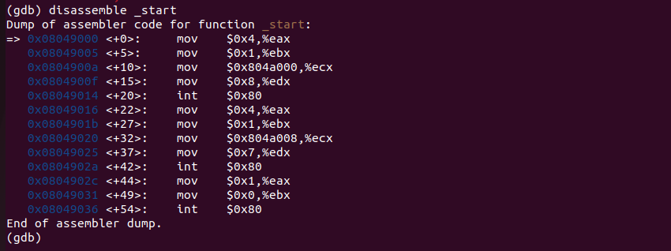{#fig:010 width=90%}

Посмотрите дисассимилированный код программы с помощью команды disassemble
начиная с метки _start(рис. @fig:010).

{#fig:010 width=90%}

Переключитесь на отображение команд с Intel’овским синтаксисом, введя команду set
disassembly-flavor intel (рис. @fig:011).

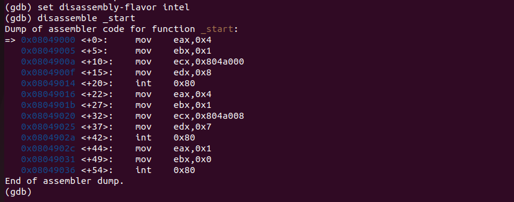{#fig:011 width=90%}

Перечислите различия отображения синтаксиса машинных команд в режимах ATT и Intel.
Включите режим псевдографики для более удобного анализа программы (рис. @fig:012):

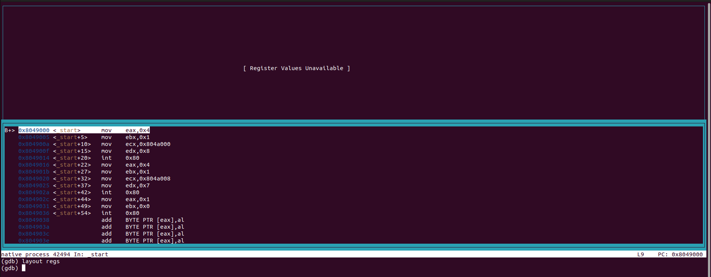{#fig:012 width=90%}

В этом режиме есть три окна:
• В верхней части видны названия регистров и их текущие значения;
• В средней части виден результат дисассимилирования программы;
• Нижняя часть доступна для ввода команд.

Установить точку останова можно командой break (кратко b). Типичный аргумент этой
команды — место установки. Его можно задать или как номер строки программы (имеет
смысл, если есть исходный файл, а программа компилировалась с информацией об отладке),
или как имя метки, или как адрес. Чтобы не было путаницы с номерами, перед адресом
ставится «звёздочка»:
На предыдущих шагах была установлена точка останова по имени метки (_start). Про-
верьте это с помощью команды info breakpoints (кратко i b) (рис. @fig:013):

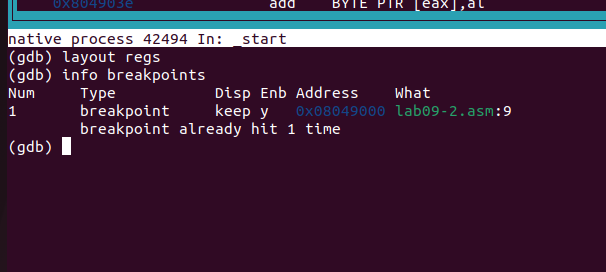{#fig:013 width=90%}

Установим еще одну точку останова по адресу инструкции. Адрес инструкции можно
увидеть в средней части экрана в левом столбце соответствующей инструкции.
Определите адрес предпоследней инструкции (mov ebx,0x0) и установите точку останова (рис. @fig:014).

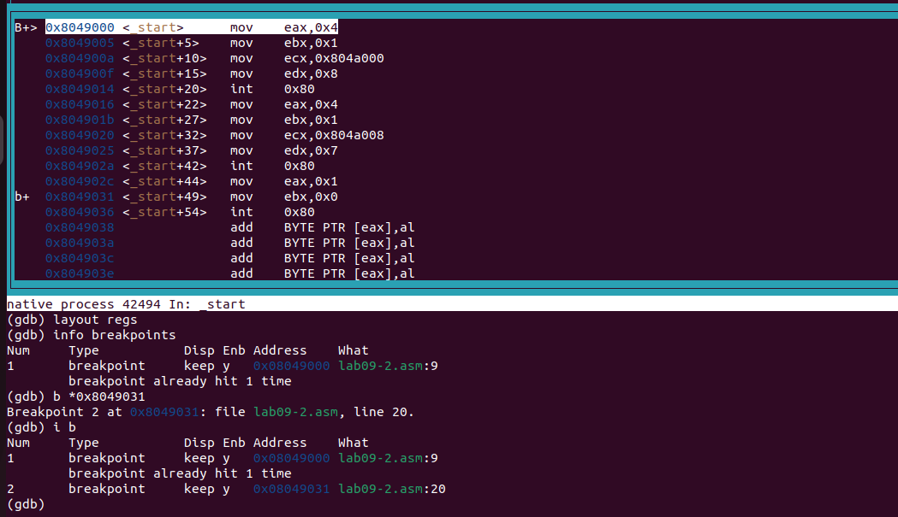{#fig:014 width=90%}

Выполните 5 инструкций с помощью команды stepi (или si) и проследите за изменением
значений регистров. Значения каких регистров изменяются?
Посмотреть содержимое регистров также можно с помощью команды info registers
(или i r) (рис. @fig:015 - @fig:020).

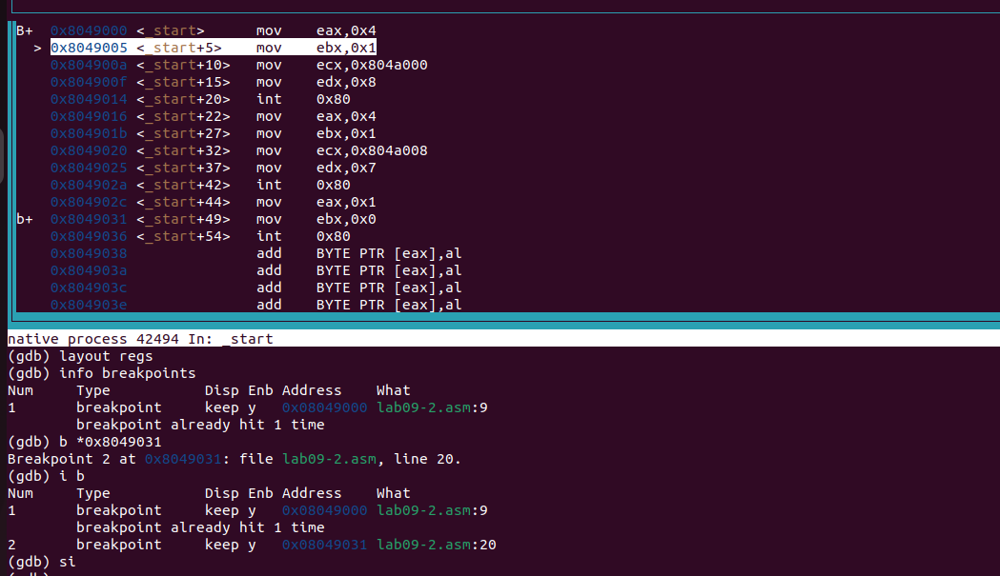{#fig:015 width=90%}

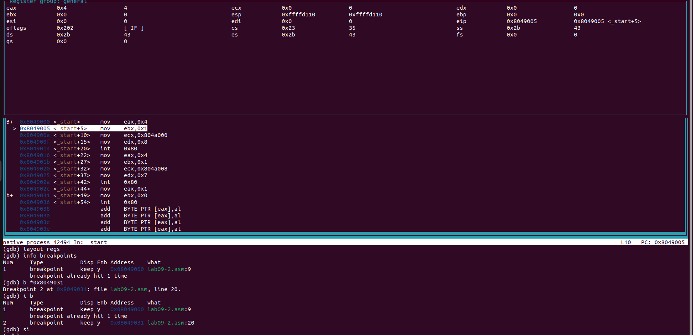{#fig:016 width=90%}

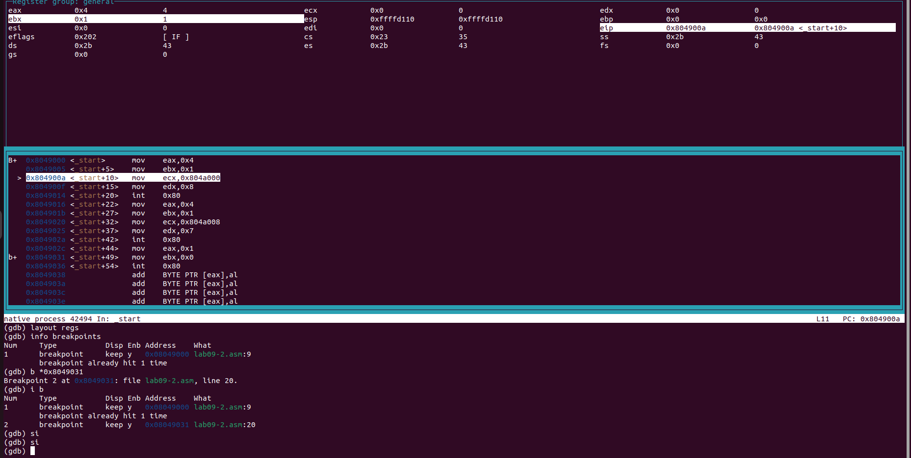{#fig:017 width=90%}

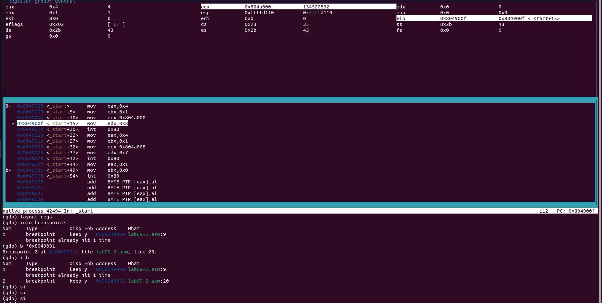{#fig:018 width=90%}

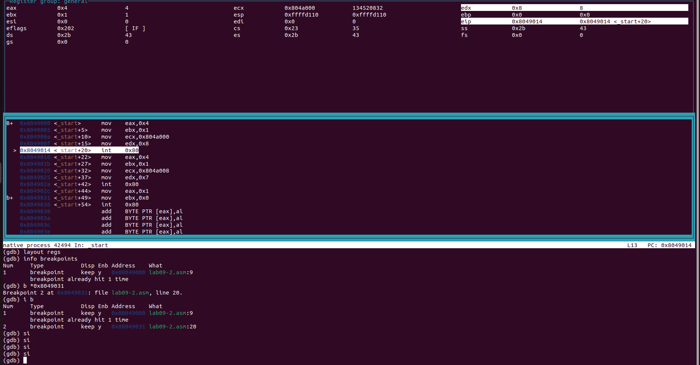{#fig:019 width=90%}

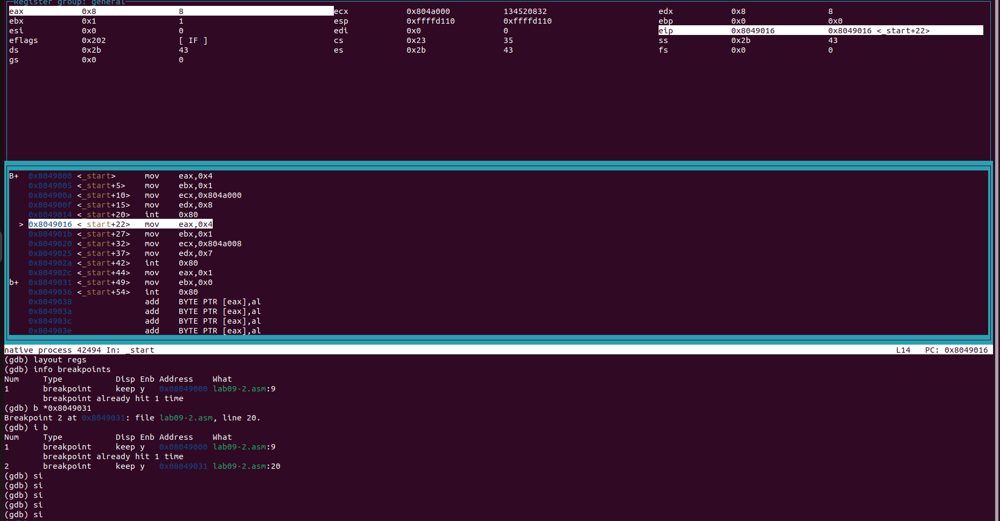{#fig:020 width=90%}

Для отображения содержимого памяти можно использовать команду x <адрес>, которая
выдаёт содержимое ячейки памяти по указанному адресу. Формат, в котором выводятся
данные, можно задать после имени команды через косую черту: x/NFU <адрес>.
С помощью команды x &<имя переменной> также можно посмотреть содержимое пере-
менной.

Посмотрите значение переменной msg1 по имени (рис. @fig:021).

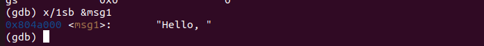{#fig:021 width=90%}

Посмотрите значение переменной msg2 по адресу. Адрес переменной можно определить
по дизассемблированной инструкции. Посмотрите инструкцию mov ecx,msg2 которая запи-
сывает в регистр ecx адрес перемененной msg2 (рис. @fig:022).

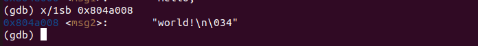{#fig:022 width=90%}

Изменить значение для регистра или ячейки памяти можно с помощью команды set,
задав ей в качестве аргумента имя регистра или адрес. При этом перед именем регистра
ставится префикс $, а перед адресом нужно указать в фигурных скобках тип данных (раз-
мер сохраняемого значения; в качестве типа данных можно использовать типы языка Си).
Измените первый символ переменной msg1 (рис. @fig:023):

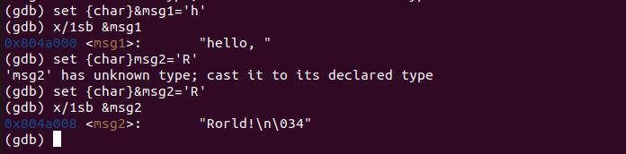{#fig:023 width=90%}

Замените любой символ во второй переменной msg2.
Чтобы посмотреть значения регистров используется команда print /F <val> (перед име-
нем регистра обязательно ставится префикс $) (рис. 9.6):
p/F $<регистр>
Выведете в различных форматах (в шестнадцатеричном формате, в двоичном формате и
в символьном виде) значение регистра edx (рис. @fig:024).
С помощью команды set измените значение регистра ebx (рис. @fig:025):

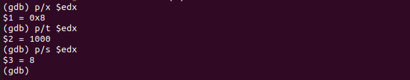{#fig:024 width=90%}

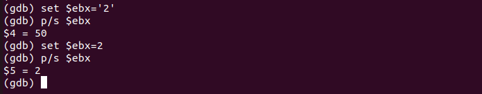{#fig:025 width=90%}

В первом случае мы занесли в регистр ebx символ ‘2’, поэтому после запроса
p/s на вывод значения регистра на экране мы увидели код символа “2”, а именно
- 50. А в случае, когда в регистр изначально было занесено число 2, а не символ,
команда p/s $ebx вывела значение 2.

Завершите выполнение программы с помощью команды continue (рис. @fig:026) (сокращенно c) или
stepi (сокращенно si) и выйдите из GDB с помощью команды quit (сокращенно q).

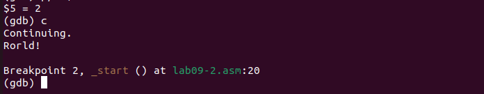{#fig:026 width=90%}

Скопируйте файл lab8-2.asm, созданный при выполнении лабораторной работы №8,
с программой выводящей на экран аргументы командной строки (Листинг 8.2) в файл с
именем lab09-3.asm:
cp ~/work/arch-pc/lab08/lab8-2.asm ~/work/arch-pc/lab09/lab09-3.asm
Создайте исполняемый файл.

Для загрузки в gdb программы с аргументами необходимо использовать ключ --args.
Загрузите исполняемый файл в отладчик, указав аргументы (рис. @fig:027):
gdb --args lab09-3 аргумент1 аргумент 2 'аргумент 3'

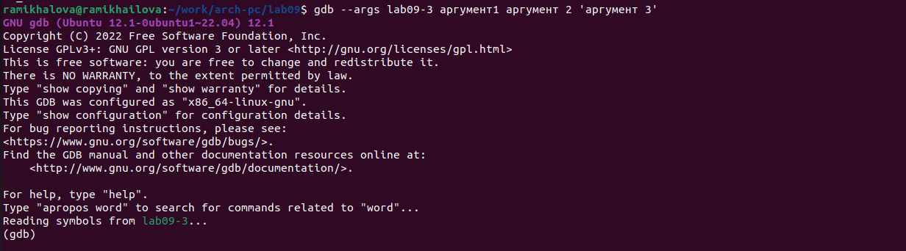{#fig:027 width=90%}

Как отмечалось в предыдущей лабораторной работе, при запуске программы аргументы
командной строки загружаются в стек. Исследуем расположение аргументов командной
строки в стеке после запуска программы с помощью gdb.
Для начала установим точку останова перед первой инструкцией в программе и запустим
ее (рис. @fig:028).

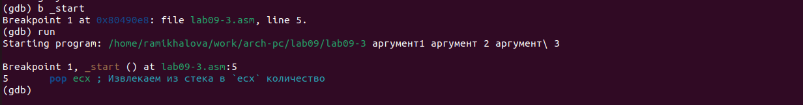{#fig:028 width=90%}

Адрес вершины стека храниться в регистре esp и по этому адресу располагается число
равное количеству аргументов командной строки (включая имя программы) (рис. @fig:029).

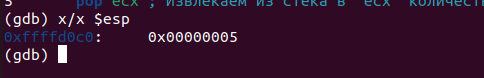{#fig:029 width=90%}

Как видно, число аргументов равно 5 – это имя программы lab09-3 и непосредственно
аргументы: аргумент1, аргумент, 2 и 'аргумент 3'.
Посмотрите остальные позиции стека – по адесу [esp+4] располагается адрес в памяти
где находиться имя программы, по адесу [esp+8] храниться адрес первого аргумента, по
аресу [esp+12] – второго и т.д (рис. @fig:030).

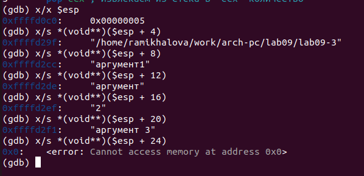{#fig:030 width=90%}

По адесу [esp+4] располагается адрес в памяти, где находиться имя програм-
мы, по адесу [esp+8] храниться адрес первого аргумента, по аресу [esp+12] –
второго и т.д. Как мы видим, шаг изменения равен 4. Шаг имеет такое значе-
ние, потому что при добавлении значения каждого аргумента в стек значение
регистра esp увеличивается на 4

# Выполнение заданий для самостоятельной работы

Задание 1

Преобразуем программу из лабораторной работы №8 (Задание №1 для са-
мостоятельной работы), реализовав вычисление значения функции как
подпрограмму.

Теперь для вычисления значения этой функции в цикле мы будем вызывать
вспомогательную подпрограмму. Создадим файл funcR.asm и впишем в него
текст программы (рис. @fig:031).

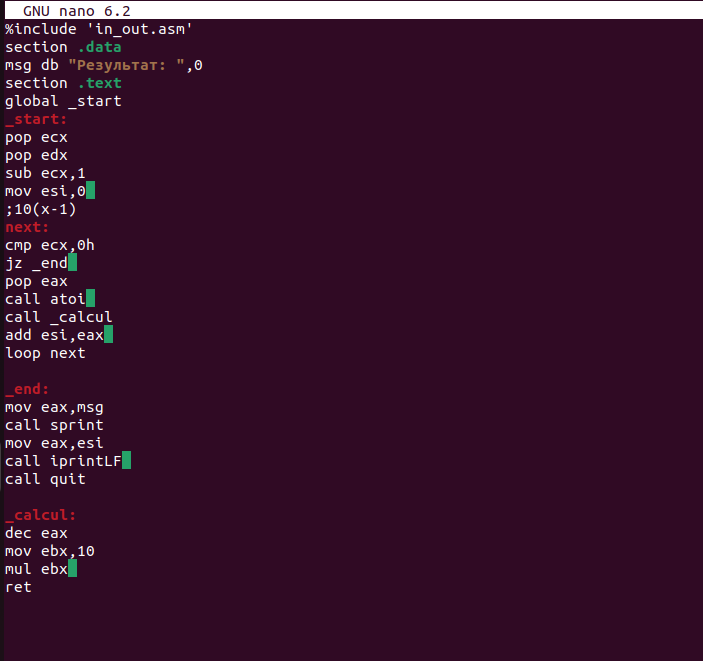{#fig:031 width=90%}

Создадим исполняемый файл и проверим его работу с теми же аргументами
(рис. @fig:032).

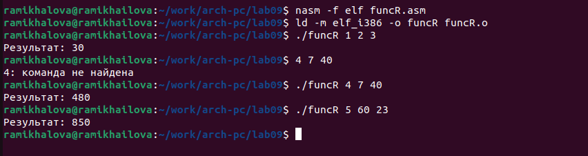{#fig:032 width=90%}

Программа работает корректно: выдаются верные значения сумм. Приступим
к выполнению следующего задания.

Задание 2

Создадим файл func2.asm и впишем в него текст программы вычисления вы-
ражения $$(3 + 2) ∗ 4 + 5$$ (рис. @fig:033).

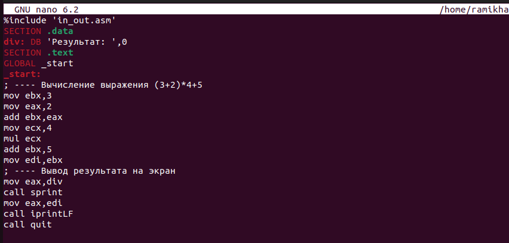{#fig:033 width=90%}

Создадим исполняемый файл и запустим его (рис. @fig:034).

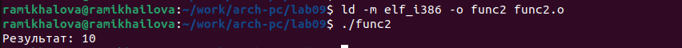{#fig:034 width=90%}

Программа и правда выдает неверный результат.
С помощью отладчика GDB проанализируем изменения значений регистров,
определим ошибку и исправим её.
Для начала загрузим исполняемый файл в отладчик (рис. @fig:035).

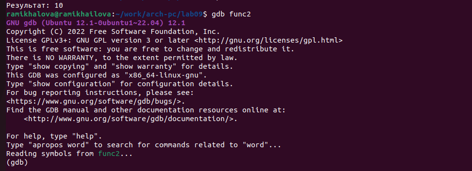{#fig:035 width=90%}

Посмотрим дисассимилированный код программы с помощью команды
disassemble, начиная с метки _start (рис. @fig:036).

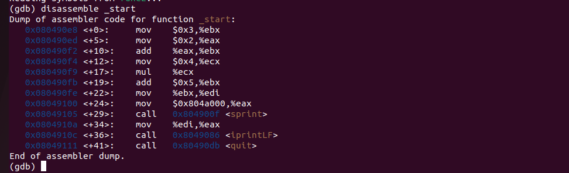{#fig:036 width=90%}

Включим режим псевдографики (рис. @fig:037).

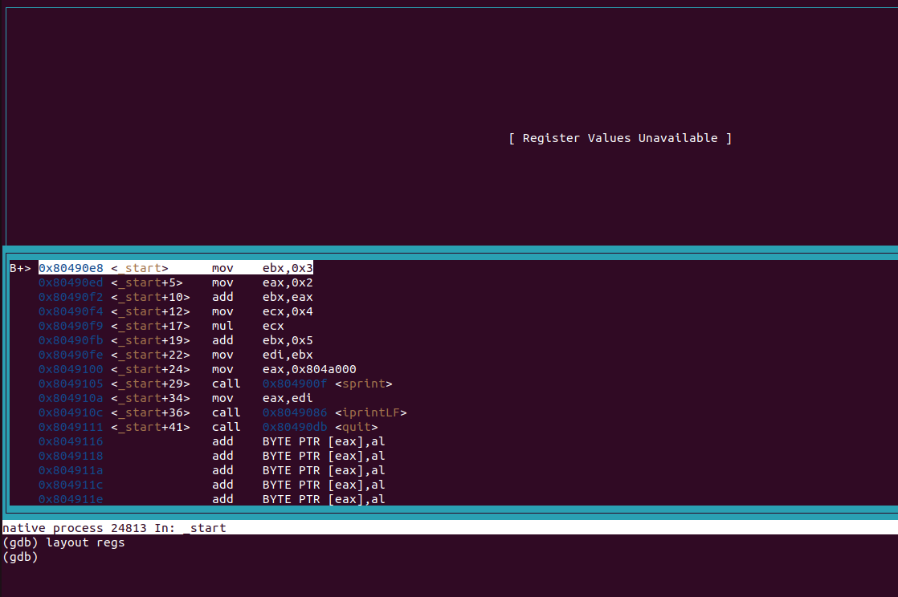{#fig:037 width=90%}

Используем команду для просмотра значений регистров (рис. @fig:038).

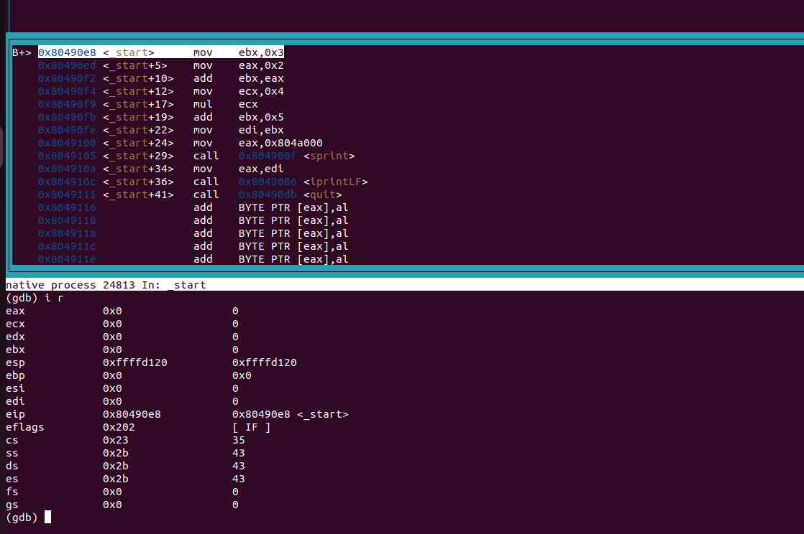{#fig:038 width=90%}

С помощью команды break установим точку останова по адресу на инструкции
add ebx,eax (рис. @fig:039).

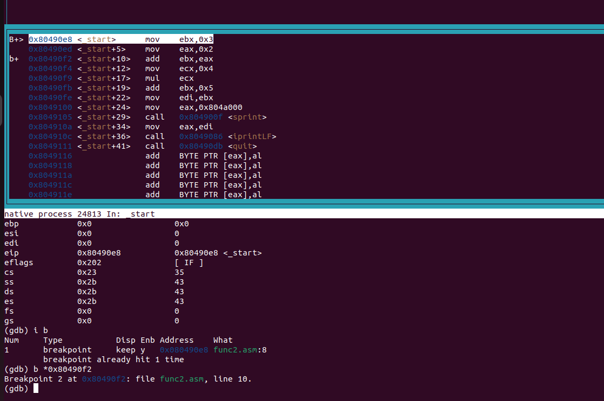{#fig:039 width=90%}

Посмотрим значения регистров на этом этапе с помощью команды i r (рис. @fig:040).

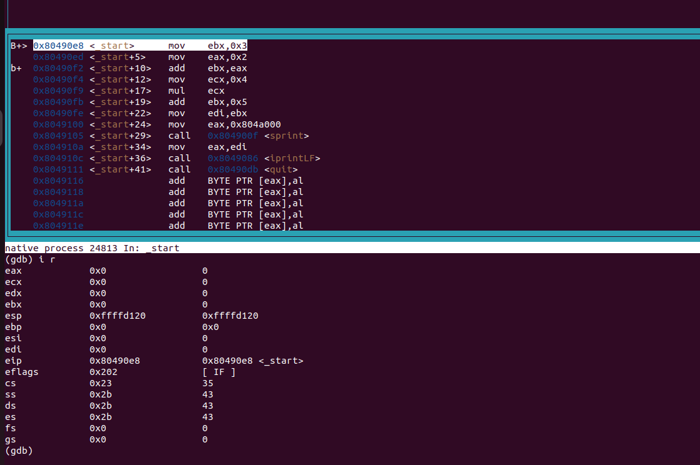{#fig:040 width=90%}

Далее с помощью команды si перейдём к следующей инструкции и проследим
за изменением значений регистров (рис. @fig:041).

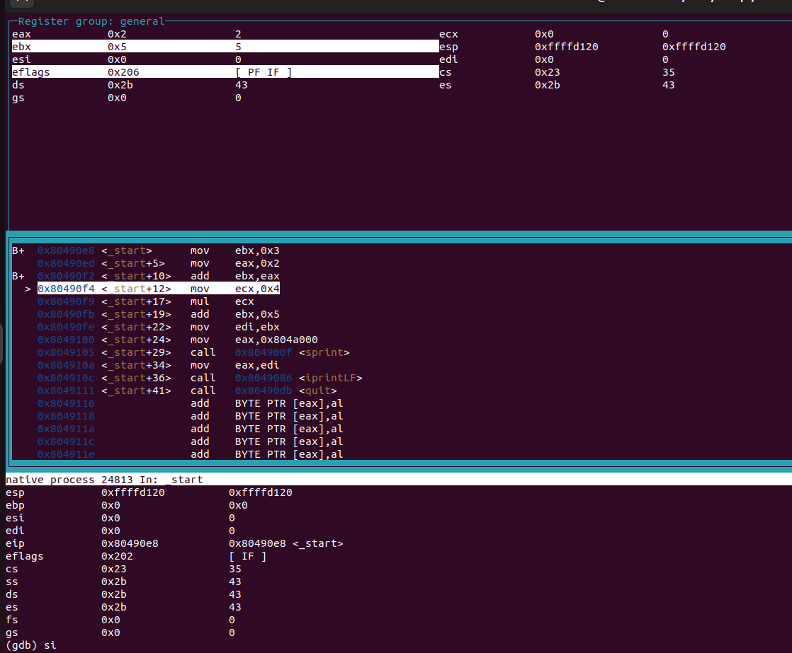{#fig:041 width=90%}

Результат суммы чисел 2 и 3 записался в регистр ebx. Это могло
послужить проблемой для дальнейшего вычисления произведения. Исправим
это, изменив значение регистра eax и занеся в него значение 5 с помощью ко-
манды set (рис. @fig:042).

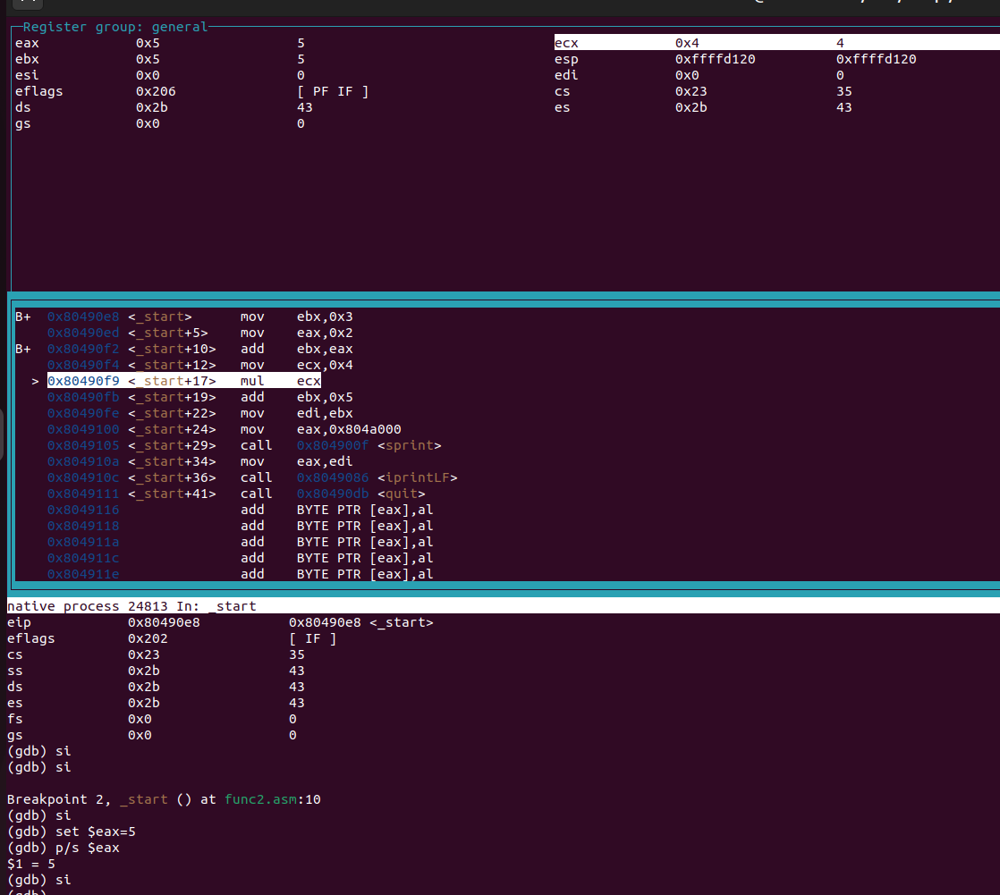{#fig:042 width=90%}

Двигаемся дальше. Мы поместили в регистр ecx значение 4 для вычисле-
ния произведения. После произведения значения регистров будут следующими (рис. @fig:043):

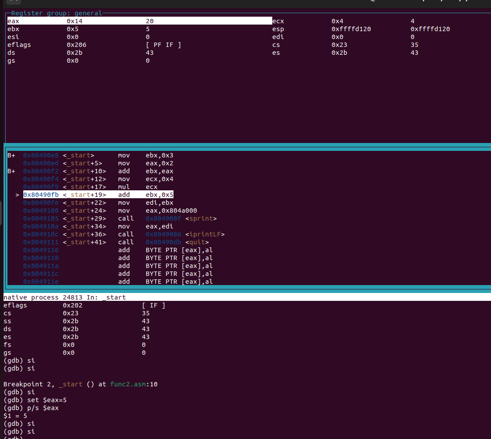{#fig:043 width=90%}

В результате в регистр eax было помещено значение произведения 20.
Далее к этому значению нужно прибавить 5. В программе за результат отвечает
регистр ebx. Поместим в него значение 20 + 5 = 25 и запустим программу на
вывод конечного результата (рис. @fig:044).

{#fig:044 width=90%}

Как мы видим, с учётом всех изменений программа выдаёт верный результат.
Теперь изменим код программы в файле func2.asm (рис. @fig:045).

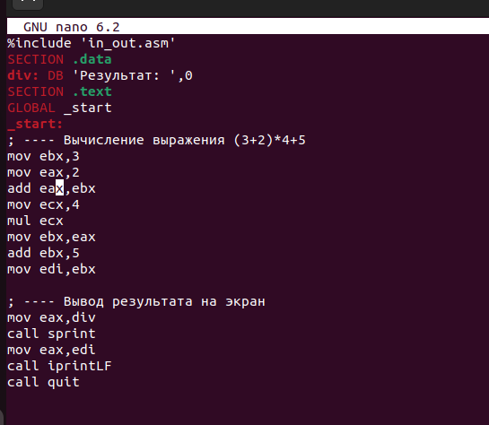{#fig:045 width=90%}

Теперь создадим исполняемый файл и проверим корректность работы про-
граммы (рис. @fig:046).

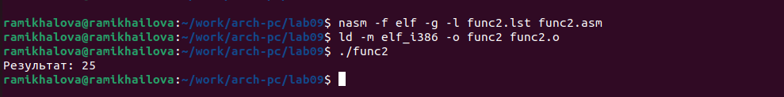{#fig:046 width=90%}

Теперь программа работает правильно.

# Выводы

В ходе выполнения лабораторной работы я приобретела навыки написания программ с использованием подпрограмм. Познакомилась
с методами отладки при помощи GDB и его основными возможностями.

# Список литературы{.unnumbered}

1. GDB: The GNU Project Debugger. — URL: https://www.gnu.org/software/gdb/.
2. GNU Bash Manual. — 2016. — URL: https://www.gnu.org/software/bash/manual/.
3. Midnight Commander Development Center. — 2021. — URL: https://midnight-commander.
org/.
4. NASM Assembly Language Tutorials. — 2021. — URL: https://asmtutor.com/.
5. Newham C. Learning the bash Shell: Unix Shell Programming. — O’Reilly Media, 2005. —
354 с. — (In a Nutshell). — ISBN 0596009658. — URL: http://www.amazon.com/Learning-
bash-Shell-Programming-Nutshell/dp/0596009658.
6. Robbins A. Bash Pocket Reference. — O’Reilly Media, 2016. — 156 с. — ISBN 978-1491941591.
7. The NASM documentation. — 2021. — URL: https://www.nasm.us/docs.php.
8. Zarrelli G. Mastering Bash. — Packt Publishing, 2017. — 502 с. — ISBN 9781784396879.
9. Колдаев В. Д., Лупин С. А. Архитектура ЭВМ. — М. : Форум, 2018.
10. Куляс О. Л., Никитин К. А. Курс программирования на ASSEMBLER. — М. : Солон-Пресс,
2017.
11. Новожилов О. П. Архитектура ЭВМ и систем. — М. : Юрайт, 2016.
12. Расширенный ассемблер: NASM. — 2021. — URL: https://www.opennet.ru/docs/RUS/nasm/.
13. Робачевский А., Немнюгин С., Стесик О. Операционная система UNIX. — 2-е изд. — БХВ-
Петербург, 2010. — 656 с. — ISBN 978-5-94157-538-1.
14. Столяров А. Программирование на языке ассемблера NASM для ОС Unix. — 2-е изд. —
М. : МАКС Пресс, 2011. — URL: http://www.stolyarov.info/books/asm_unix.
15. Таненбаум Э. Архитектура компьютера. — 6-е изд. — СПб. : Питер, 2013. — 874 с. —
(Классика Computer Science).
16. Таненбаум Э., Бос Х. Современные операционные системы. — 4-е изд. — СПб. : Питер,
2015. — 1120 с. — (Классика Computer Science).
