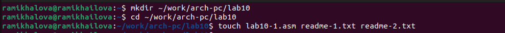
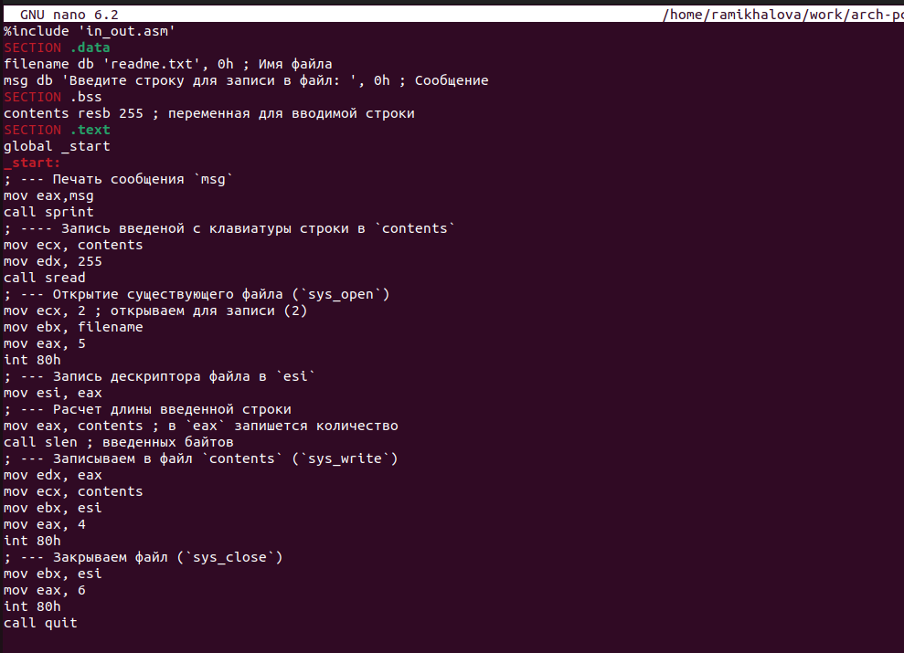
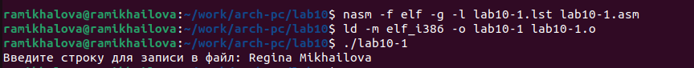
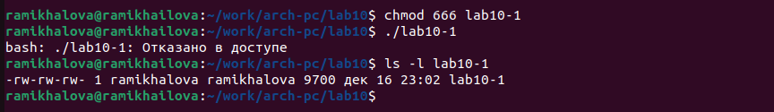
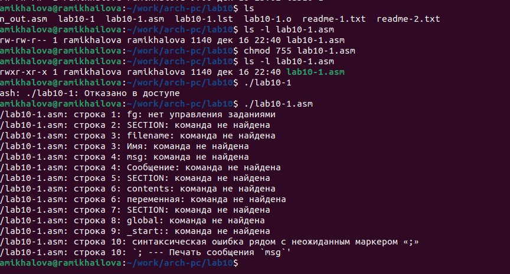
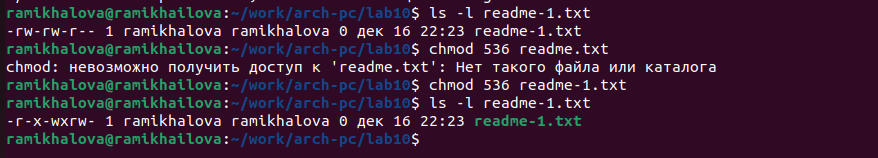
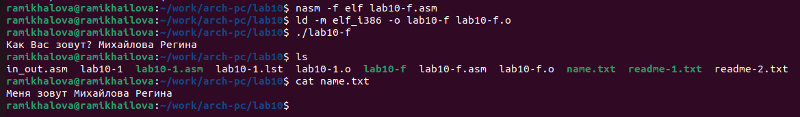

---
## Front matter
title: "Отчет по лабораторной работе №8"
subtitle: "дисциплина: Архитектура компьютера"
author: "Михайлова Регина Алексеевна"

## Generic otions
lang: ru-RU
toc-title: "Содержание"

## Bibliography
bibliography: bib/cite.bib
csl: pandoc/csl/gost-r-7-0-5-2008-numeric.csl

## Pdf output format
toc: true # Table of contents
toc-depth: 2
lof: true # List of figures
lot: true # List of tables
fontsize: 12pt
linestretch: 1.5
papersize: a4
documentclass: scrreprt
## I18n polyglossia
polyglossia-lang:
  name: russian
  options:
	- spelling=modern
	- babelshorthands=true
polyglossia-otherlangs:
  name: english
## I18n babel
babel-lang: russian
babel-otherlangs: english
## Fonts
mainfont: PT Serif
romanfont: PT Serif
sansfont: PT Sans
monofont: PT Mono
mainfontoptions: Ligatures=TeX
romanfontoptions: Ligatures=TeX
sansfontoptions: Ligatures=TeX,Scale=MatchLowercase
monofontoptions: Scale=MatchLowercase,Scale=0.9
## Biblatex
biblatex: true
biblio-style: "gost-numeric"
biblatexoptions:
  - parentracker=true
  - backend=biber
  - hyperref=auto
  - language=auto
  - autolang=other*
  - citestyle=gost-numeric
## Pandoc-crossref LaTeX customization
figureTitle: "Рис."
tableTitle: "Таблица"
listingTitle: "Листинг"
lofTitle: "Список иллюстраций"
lotTitle: "Список таблиц"
lolTitle: "Листинги"
## Misc options
indent: true
header-includes:
  - \usepackage{indentfirst}
  - \usepackage{float} # keep figures where there are in the text
  - \floatplacement{figure}{H} # keep figures where there are in the text
---

# Цель работы

Приобретение навыков написания программ для работы с файлами.

# Выполнение лабораторной работы

1. Создайте каталог для программам лабораторной работы № 10, перейдите в него и
создайте файлы lab10-1.asm, readme-1.txt и readme-2.txt (рис. @fig:001):

mkdir ~/work/arch-pc/lab09
cd ~/work/arch-pc/lab09
touch lab10-1.asm readme-1.txt readme-2.txt

{#fig:001 width=90%}

2. Введите в файл lab10-1.asm текст программы из листинга 10.1 (Программа записи в
файл сообщения) (рис. @fig:002). Создайте исполняемый файл и проверьте его работу (рис. @fig:003).

{#fig:002 width=90%}

{#fig:003 width=90%}

3. С помощью команды chmod измените права доступа к исполняемому файлу lab10-1,
запретив его выполнение. Попытайтесь выполнить файл (рис. @fig:004). Объясните результат.

{#fig:004 width=90%}

B доступе отказано. Это связано с тем, что мы заблокировали
права на исполнение с помощью команды chmod 666.

4. С помощью команды chmod измените права доступа к файлу lab10-1.asm с исходным
текстом программы, добавив права на исполнение (рис. @fig:005). Попытайтесь выполнить его и
объясните результат.

{#fig:005 width=90%}

Права на исполнение файла у нас есть, однако никаких действий
не выполняется, ведь это файл с исходным кодом, который требует предваритель-
ной сборки.

5. В соответствии с вариантом в таблице 10.4 предоставить права доступа к файлу readme-
1.txt представленные в символьном виде, а для файла readme-2.txt – в двочном виде (рис. @fig:006).
Проверить правильность выполнения с помощью команды ls -l (рис. @fig:007).

В соответствии с вариантом 17 выполняю программы.

{#fig:006 width=90%}

{#fig:007 width=90%}


# Выполнение заданий для самостоятельной работы

1. Напишите программу работающую по следующему алгоритму:
• Вывод приглашения “Как Вас зовут?”
• ввести с клавиатуры свои фамилию и имя
• создать файл с именем name.txt
• записать в файл сообщение “Меня зовут”
• дописать в файл строку введенную с клавиатуры
• закрыть файл

Создадим файл func.asm и запишем в него текст программы, представленной
на листинге 10.2.

```NASM
Листинг 10.2. Программа записи сообщений в созданный файл
%include 'in_out.asm'
SECTION .data
filename db 'name.txt', 0h ; Имя файла
msg db 'Как Вас зовут? ', 0h
msg1 db 'Меня зовут ', 0h
SECTION .bss
MyName resb 255 ; переменная для вводимой строки
SECTION .text
global _start
_start:
mov eax,msg
call sprint
mov ecx, MyName
mov edx, 255
call sread
mov ecx, 0777o ; права доступа
mov ebx, filename
mov eax, 8 ;номер системного вызова
int 80h
mov esi, eax
mov eax,msg1 ; в "eax" запишется количество введённых байтов
call slen
mov edx, eax ; количество байтов для записи
mov ecx, msg1 ; адрес строки для записи в файл
mov ebx, esi ; дескриптор файла
mov eax, 4 ; номер системного вызова `sys_write`
int 80h
mov eax, MyName ; "eax" запишется количество введённых байто
call slen
mov edx, eax
mov ecx, MyName
mov ebx, esi
mov eax, 4
int 80h
mov ebx, esi
mov eax, 6
int 80h
call quit
```

Создадим исполняемый файл и проверим его работу. Проверим наличие файла
и его содержимое с помощью команд ls и cat (рис. @fig:008).

{#fig:008 width=90%}

Как мы видим, программа соотвествует алгоритму и работает корректно.

# Выводы

В ходе выполнения лабораторной работы я приобретела навык написания программ для работы с файлами.

# Список литературы{.unnumbered}

1. GDB: The GNU Project Debugger. — URL: https://www.gnu.org/software/gdb/.
2. GNU Bash Manual. — 2016. — URL: https://www.gnu.org/software/bash/manual/.
3. Midnight Commander Development Center. — 2021. — URL: https://midnight-commander.
org/.
4. NASM Assembly Language Tutorials. — 2021. — URL: https://asmtutor.com/.
5. Newham C. Learning the bash Shell: Unix Shell Programming. — O’Reilly Media, 2005. —
354 с. — (In a Nutshell). — ISBN 0596009658. — URL: http://www.amazon.com/Learning-
bash-Shell-Programming-Nutshell/dp/0596009658.
6. Robbins A. Bash Pocket Reference. — O’Reilly Media, 2016. — 156 с. — ISBN 978-1491941591.
7. The NASM documentation. — 2021. — URL: https://www.nasm.us/docs.php.
8. Zarrelli G. Mastering Bash. — Packt Publishing, 2017. — 502 с. — ISBN 9781784396879.
9. Колдаев В. Д., Лупин С. А. Архитектура ЭВМ. — М. : Форум, 2018.
10. Куляс О. Л., Никитин К. А. Курс программирования на ASSEMBLER. — М. : Солон-Пресс,
2017.
11. Новожилов О. П. Архитектура ЭВМ и систем. — М. : Юрайт, 2016.
12. Расширенный ассемблер: NASM. — 2021. — URL: https://www.opennet.ru/docs/RUS/nasm/.
13. Робачевский А., Немнюгин С., Стесик О. Операционная система UNIX. — 2-е изд. — БХВ-
Петербург, 2010. — 656 с. — ISBN 978-5-94157-538-1.
14. Столяров А. Программирование на языке ассемблера NASM для ОС Unix. — 2-е изд. —
М. : МАКС Пресс, 2011. — URL: http://www.stolyarov.info/books/asm_unix.
15. Таненбаум Э. Архитектура компьютера. — 6-е изд. — СПб. : Питер, 2013. — 874 с. —
(Классика Computer Science).
16. Таненбаум Э., Бос Х. Современные операционные системы. — 4-е изд. — СПб. : Питер,
2015. — 1120 с. — (Классика Computer Science).
Демидова А. В.

